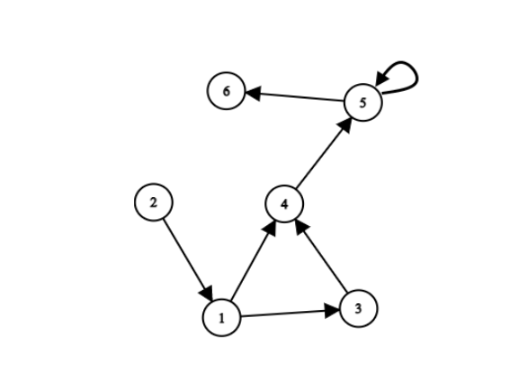

# 1547G How Many Paths 题解（C++）

## 题意重述

给定一个有向图，起点固定为 `1`。

对于每个点 `v`，需要判断从 `1` 到 `v` 的路径数量属于下面哪一种：

- `0`：一条路径也没有
- `1`：恰好一条路径
- `2`：路径多于一条，但总数有限
- `-1`：路径有无穷多条



注意：

- 图里允许有环
- 图里允许有自环
- 但不存在重边

题目的难点不在于“数路径”，而在于区分：

1. 多条但有限
2. 无穷多条

这两类不能混在一起处理。

---

## 先想清楚：为什么会出现无穷多条路径？

只有一种原因：

> 从 `1` 出发，能走进某个环，然后还能从这个环走到目标点。

一旦满足这个条件，我们就可以在环里多绕任意多圈，再离开去目标点，于是路径数就是无穷。

所以整道题本质上分成两步：

1. 找出哪些点的答案一定是 `-1`
2. 对剩下的点统计“有限路径数量”，但只需要区分 `0 / 1 / 大于 1`

---

## 核心思路总览

算法分成 4 步：

1. 从 `1` 出发做一次遍历，只保留 **可达点**
2. 在可达子图里做 **强连通分量（SCC）分解**
3. 找出所有“含环 SCC”，并从这些点继续向外传播，标记答案为 `-1`
4. 删除这些 `-1` 点后，剩余图一定是 DAG，在 DAG 上做一次路径 DP

---

## 第一步：只关心从 1 可达的部分

很多环可能根本到不了，自然不会影响答案。

所以第一步先从 `1` 出发 DFS/BFS，得到 `reach[u]`：

- `reach[u] = true`：从 `1` 能走到 `u`
- `reach[u] = false`：从 `1` 走不到 `u`

后面所有分析都只在可达子图中进行。

这样做有两个好处：

- 不会把无关的环误判成 `-1`
- SCC 和 DP 的规模都变小了

---

## 第二步：用 SCC 找“会产生无限路径”的环

### 1. 为什么要用 SCC？

因为一个强连通分量中的点两两可达。

如果某个 SCC：

- 大小大于 `1`
- 或者大小等于 `1` 但存在自环

那么这个 SCC 内一定存在环。

只要这个 SCC 又是从 `1` 可达的，那么：

- SCC 内所有点都能被无限次绕圈访问
- 这些点的答案一定是 `-1`

### 2. 哪些点也会被这个环影响？

不光是环里的点。

只要某个点可以从这个含环 SCC 走到，它的答案也一定是 `-1`。

原因很简单：

- 先从 `1` 走到这个环
- 在环里绕 `k` 圈
- 再离开走到目标点

`k` 可以任意大，所以路径数无穷。

### 3. 如何标记这些点？

做法很直接：

- 先找出所有“含环 SCC”
- 把这些 SCC 里的所有点作为多源起点
- 在原图上继续向外搜索
- 所有能被搜到的点都标记为 `infinite[u] = true`

---

## 第三步：为什么删掉 `-1` 点之后一定是 DAG？

这是这题最关键的转折点。

我们把所有 `infinite[u] = true` 的点删掉，只看剩下的可达点。

如果剩余图里还存在一个环，那么这个环上的点一定属于某个可达 SCC，并且这个 SCC 含环。

那它们本来就应该被标成 `-1`，这和“它们还留在剩余图里”矛盾。

所以：

> 删除所有无限点后，剩余可达子图一定无环，也就是 DAG。

一旦变成 DAG，路径计数就简单了。

---

## 第四步：在 DAG 上做截断路径计数

对于剩下的点，只需要区分三种情况：

- `0` 条
- `1` 条
- `超过 1` 条

所以 DP 根本不需要真的统计完整路径数，只需要把值截断到 `2`：

```cpp
dp[v] = min(2, dp[v] + dp[u]);
```

这里的含义是：

- `0`：还没有路径到它
- `1`：目前恰好一条
- `2`：已经至少两条了，后面再多也没必要继续算

### 状态定义

`dp[u]` 表示在“删掉无限点之后”的 DAG 中，从 `1` 到 `u` 的路径数，且最大只记到 `2`。

### 初值

```cpp
dp[1] = 1
```

因为长度为 `0` 的空路径也算从 `1` 到 `1` 的一条路径。

### 转移

按拓扑序遍历 DAG：

```cpp
for (u -> v) {
    dp[v] = min(2, dp[v] + dp[u]);
}
```

---

## 正确性证明

下面把结论分开证明。

### 结论 1：若点 `v` 被标记为 `infinite`，则答案一定是 `-1`

`v` 被标记为 `infinite`，说明存在一条路径：

- 从 `1` 到某个含环 SCC
- 再从该 SCC 到 `v`

由于这个 SCC 内可以绕任意多圈，所以对任意非负整数 `k`，都能构造一条“先绕 `k` 圈，再到 `v`”的路径。

因此从 `1` 到 `v` 的路径数无穷，答案必为 `-1`。

### 结论 2：若点 `v` 没有被标记为 `infinite`，那么从 `1` 到 `v` 的路径数一定有限

反设从 `1` 到 `v` 的路径数无穷，但 `v` 没被标记为 `infinite`。

路径数无穷意味着某条通往 `v` 的路径上一定可以无限次重复经过某个环，也就是存在一个从 `1` 可达且能到达 `v` 的含环 SCC。

按第二步的标记规则，`v` 本应被标成 `infinite`，矛盾。

所以未被标记的点路径数一定有限。

### 结论 3：删除所有 `infinite` 点后，剩余可达图一定是 DAG

如果剩余图里还有环，那么这个环本身就构成一个从 `1` 可达的含环 SCC。

根据第二步，这个 SCC 以及它内部所有点都应该被标记为 `infinite`，不可能还留在剩余图中，矛盾。

因此剩余图无环，是 DAG。

### 结论 4：DAG 上的拓扑 DP 得到的就是有限路径分类结果

在 DAG 中，任意点的所有前驱都会在它之前被处理。

所以当处理到 `u` 时，`dp[u]` 已经等于从 `1` 到 `u` 的所有有限路径数（截断到 `2`）。
再把这些路径沿每条出边转移给后继点，就恰好枚举了所有从 `1` 到后继点的路径。

由于使用了 `min(2, ...)` 截断：

- `0` 仍表示无路径
- `1` 仍表示唯一一条
- `2` 表示至少两条，也就是题目要求的“多于一条但有限”

因此 DP 结果正确。

---

## 复杂度分析

设单组数据有 `n` 个点、`m` 条边。

- 可达性搜索：`O(n + m)`
- SCC 分解：`O(n + m)`
- 无限状态传播：`O(n + m)`
- DAG 拓扑 DP：`O(n + m)`

总复杂度：

```text
O(n + m)
```

空间复杂度：

```text
O(n + m)
```

完全可以通过题目限制。

---

## 实现细节与易错点

### 1. 自环也算会产生无限路径

比如 `5 -> 5`，即使这个 SCC 只有一个点，也必须判成“含环”。

### 2. 只处理从 1 可达的点

不可达环与答案无关，不能误伤。

### 3. 不要真的统计完整路径数

题目只需要 `0 / 1 / 2 / -1` 四种结果。

有限路径部分最多记到 `2` 就够了：

- 防止无意义的大整数累加
- 逻辑更简洁

### 4. 最好用迭代 DFS

数据范围很大，递归写 SCC 容易爆栈。

---

## C++17 参考实现

```cpp
#include <bits/stdc++.h>
using namespace std;

int main() {
    ios::sync_with_stdio(false);
    cin.tie(nullptr);

    int T;
    cin >> T;
    while (T--) {
        int n, m;
        cin >> n >> m;

        vector<vector<int>> g(n + 1), rg(n + 1);
        vector<pair<int, int>> edges;
        edges.reserve(m);

        for (int i = 0; i < m; ++i) {
            int u, v;
            cin >> u >> v;
            g[u].push_back(v);
            rg[v].push_back(u);
            edges.push_back({u, v});
        }

        // 第一步：筛出从 1 可达的点
        vector<char> reach(n + 1, 0);
        stack<int> st;
        st.push(1);
        reach[1] = 1;
        while (!st.empty()) {
            int u = st.top();
            st.pop();
            for (int v : g[u]) {
                if (!reach[v]) {
                    reach[v] = 1;
                    st.push(v);
                }
            }
        }

        // 第二步：Kosaraju 第一遍，得到后序
        vector<char> vis(n + 1, 0);
        vector<int> order;
        order.reserve(n);

        if (reach[1]) {
            stack<pair<int, int>> dfs;
            dfs.push({1, 0});
            vis[1] = 1;

            while (!dfs.empty()) {
                int u = dfs.top().first;
                int &idx = dfs.top().second;

                if (idx < (int)g[u].size()) {
                    int v = g[u][idx++];
                    if (reach[v] && !vis[v]) {
                        vis[v] = 1;
                        dfs.push({v, 0});
                    }
                } else {
                    order.push_back(u);
                    dfs.pop();
                }
            }
        }

        // 第二步：Kosaraju 第二遍，划分 SCC
        vector<int> comp(n + 1, -1);
        vector<int> compSize;
        int compCnt = 0;

        for (int i = (int)order.size() - 1; i >= 0; --i) {
            int s = order[i];
            if (comp[s] != -1) {
                continue;
            }

            int sz = 0;
            stack<int> rev;
            rev.push(s);
            comp[s] = compCnt;

            while (!rev.empty()) {
                int u = rev.top();
                rev.pop();
                ++sz;

                for (int v : rg[u]) {
                    if (reach[v] && comp[v] == -1) {
                        comp[v] = compCnt;
                        rev.push(v);
                    }
                }
            }

            compSize.push_back(sz);
            ++compCnt;
        }

        vector<char> hasSelfLoop(compCnt, 0);
        for (auto [u, v] : edges) {
            if (reach[u] && u == v) {
                hasSelfLoop[comp[u]] = 1;
            }
        }

        vector<char> badComp(compCnt, 0);
        for (int c = 0; c < compCnt; ++c) {
            if (compSize[c] > 1 || hasSelfLoop[c]) {
                badComp[c] = 1;
            }
        }

        // 第三步：从所有含环 SCC 出发，向后传播 -1
        vector<char> infinite(n + 1, 0);
        queue<int> q;
        for (int u = 1; u <= n; ++u) {
            if (reach[u] && badComp[comp[u]] && !infinite[u]) {
                infinite[u] = 1;
                q.push(u);
            }
        }

        while (!q.empty()) {
            int u = q.front();
            q.pop();
            for (int v : g[u]) {
                if (reach[v] && !infinite[v]) {
                    infinite[v] = 1;
                    q.push(v);
                }
            }
        }

        // 第四步：删掉 infinite 点后，剩余可达子图是 DAG，做拓扑 DP
        vector<int> indeg(n + 1, 0);
        for (int u = 1; u <= n; ++u) {
            if (!reach[u] || infinite[u]) {
                continue;
            }
            for (int v : g[u]) {
                if (reach[v] && !infinite[v]) {
                    ++indeg[v];
                }
            }
        }

        queue<int> topo;
        for (int u = 1; u <= n; ++u) {
            if (reach[u] && !infinite[u] && indeg[u] == 0) {
                topo.push(u);
            }
        }

        vector<int> dp(n + 1, 0);
        if (!infinite[1]) {
            dp[1] = 1;
        }

        while (!topo.empty()) {
            int u = topo.front();
            topo.pop();

            for (int v : g[u]) {
                if (!reach[v] || infinite[v]) {
                    continue;
                }
                dp[v] = min(2, dp[v] + dp[u]);
                if (--indeg[v] == 0) {
                    topo.push(v);
                }
            }
        }

        for (int u = 1; u <= n; ++u) {
            int ans;
            if (!reach[u]) {
                ans = 0;
            } else if (infinite[u]) {
                ans = -1;
            } else {
                ans = dp[u];
            }

            cout << ans << (u == n ? '\n' : ' ');
        }
    }

    return 0;
}
```

---

## 用一句话总结

这题的本质是：

> 先用 SCC 找出“能把路径数变成无穷”的环，再把剩余部分当成 DAG 做截断路径计数。

如果你把这两部分分开，这题就会变得很顺。
